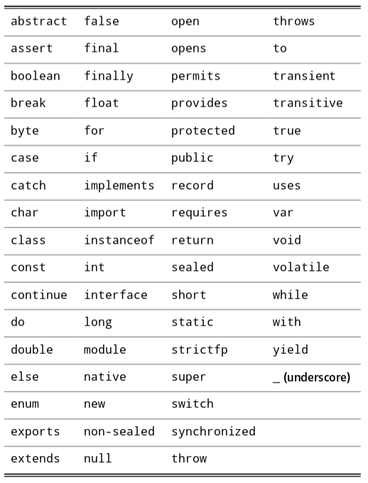

# Chapter 1: Java Programming Basics

## Looking at the venerable `Hello, World!` program

[listing 1-1](../../code/Listing%201-1/HelloApp.java)

## Dealing with keywords

## Working with statements

### types of statements
### white space

## Working with blocks

## Creating identifiers

## Crafting comments

## Introducing object-oriented-programming

## Importing Java API classes

