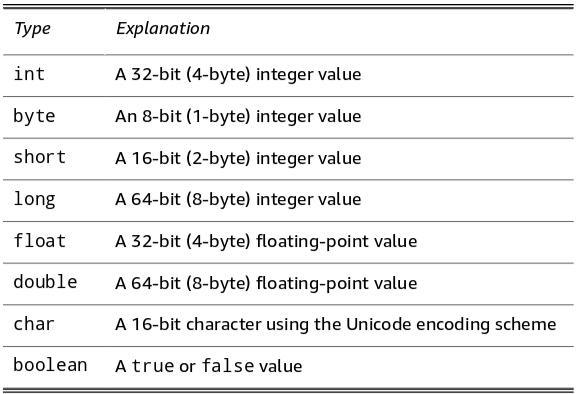

# Chapter 2: Working with Variables and Data Types

## Declaring variables

> In Java, you must explicitly declare all variables before using them.

### declaring two or more variables in one statement
```java
int x, y, z;
```

### declaring [class variable]s

- declaration inside class body, but not method body
- must use the `static` keyword

### declaring [instance variable]s

- *static* methods cannot access [instance variable]s

### declaring [local variable]s

- local variables are *local* to functions

## Initializing variables

> In Java, local variables are not given initial default values. ... You must initialize local variables before you use them.
>

- [class variable]s and [instance variable]s are given default values


### initializing variables with [assignment statement]s
```java
int var;
var = 23;
```
### initializing variables with [initializer]s
```java
type name = expression; // ie
int num = 42; // or
int x = 5, y = 10;
```

## Using [final variable]s (constants)

- used for values that are universally the same 
- add *static final* 
```java
static final int WEEKDAYS = 5;
```

## Working with primitive [data type]s

- [primitive type] and [reference type]
- memory address contains the actual value or a pointer, respectively
- an *array* is a [reference type]

- eight primitive types:



### integer types
### [floating-point] types

- float (4 bytes)
- double (8 bytes) *double* a float
- favor the *double* type
- see [book2, ch3](../ch3)


## Working with strings

## Converting and casting numeric data

## Thinking inside the box

## Understanding scope

[listing 2-1](../code/Listing%202-1/ScopeApp.java)

## Shadowing variables

## Printing data with `System.out`

## Getting input with the `Scanner` class

## Getting input with the `JOptionPane` class

[listing 2-4](../code/Listing%202-4/DialogApp.java)

## Using enum to create your own data types


[assignment statement]: use the `=` operator
[class variable]: a variable that any method(even *static* methods) in a class can access. aka [static variable]
[data type]: the type of data that can be stored in a variable
[static variable]: see [class variable]
[instance variable]: a variable associated with the *instance* of a class.
[initializer]: type name = expression; combine declaration and assignment in one statement
[local variable]: a variable declared within the body of a method. not given a default value
[final variable]: a variable whose value you can't change after it's been initialized
[strongly typed]: variables type must be specified at initialization.
[primitive type]: data types defined by Java
[reference type]: types defined by the Java API or user created
[floating-point]: numbers that have fractional parts